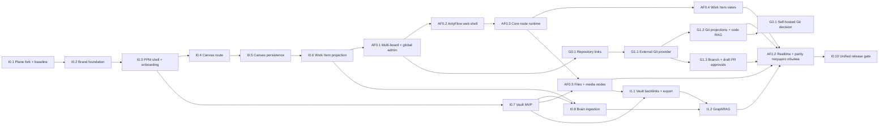

# 15 — План реализации и релизы

## Принцип планирования

Двухдневный срок относится к демонстрационному вертикальному срезу, а не ко всей платформе. Полная визуальная замена всех экранов, production RAG, Obsidian-like Vault и Git hosting разбиты на независимые gates.

Полная последовательность после решения о переносе всего AntyFlow, обязательной Git-интеграции и сохранении
незавершённых задач прежнего плана вынесена в [22 — Полный план завершения PPM](<22 — Полный план завершения PPM.md>).
Этот документ сохраняет release framing; документ 22 является мастер-планом исполнения.
Решение владельца от 2026-09-23 исключило AI-провайдеров и агентов из
текущих релизов. Ранний двухдневный D0 и журнал AF1.1 ниже являются
историческим отчётом, а не планом работ. Действующие зависимости и gate
определяет документ 22.

## Карта этапов



## История: Release D0 — двухдневная демонстрация

### Цель

Доказать идентичность продукта и главный сквозной сценарий, не имитируя production readiness.

### Обязательный результат

- чистый Plane baseline запускается;
- пользователь видит PPM name/logo/colors и русскую оболочку;
- project navigation содержит `Мозг проекта`;
- Canvas сохраняет заметки и Work Item projections;
- минимальный Vault создаёт/читает Markdown и загружает PDF;
- Project Brain индексирует Work Item, Markdown и PDF text layer;
- пользователь задаёт вопрос и получает ответ с citations;
- всё работает с одной Plane session;
- два проекта не смешиваются;
- известные ограничения показаны.

### Честные ограничения D0

- не все экраны Plane полностью перерисованы;
- Canvas realtime может быть выключен;
- Vault поддерживает ограниченный набор типов;
- RAG рассчитан на демонстрационный объём;
- write agents выключены;
- Git ограничен ссылкой на repository либо mock/ручной link;
- production backup, SSO и hardening не заявляются готовыми без фактической проверки.

## День 1

### Блок A — baseline

1. Fork/pin Plane `v1.4.2`.
2. Сохранить upstream и legal provenance.
3. Поднять clean stack.
4. Пройти register → workspace → project → Work Item → Page → restart.

### Блок B — визуальная идентичность

1. Добавить `ppm-brand` tokens.
2. Подключить палитру Графит/Светлая.
3. Заменить app name, logo, favicon и основные meta.
4. Переработать auth/onboarding и navigation shell.
5. Сделать legal/source page.

### Gate дня 1

Пользователь регистрируется и выполняет базовую работу, не встречая Plane branding на основном пути. Чистый baseline остаётся воспроизводимым отдельным commit/ref.

## День 2

### Блок C — Canvas

1. Добавить project route `Мозг проекта`.
2. Перенести browser-safe tldraw core.
3. Реализовать note и work_item_ref.
4. Сохранить versioned snapshot.
5. Проверить права двух пользователей/двух проектов.

### Блок D — Vault и Brain

1. Создать Vault root и минимальное tree API.
2. Реализовать Markdown create/read/write и PDF upload.
3. Добавить index policy.
4. Проиндексировать Work Item, Markdown и PDF text.
5. Выполнить hybrid либо keyword+dense retrieval по доступной конфигурации.
6. Вывести answer node с citations.

### Gate дня 2

Сценарий:

```text
register
→ project
→ Work Item
→ Vault Markdown/PDF
→ Canvas projections
→ connect nodes
→ ask project
→ answer with citations
→ reload
```

проходит на двух тестовых проектах без утечки.

## Поток AF — полноценный AntyFlow Canvas

Решение владельца от 2026-09-19 меняет Canvas с минимального дополнения на основной web-интерфейс проекта.
Desktop AntyFlow является эталоном поведения, но небезопасные Electron-механизмы заменяются server adapters.

### AF0 — общий Canvas проекта и визуальная основа

1. **AF0.1 — multi-board foundation и global admin:** один Canvas проекта, много общих досок, migration текущего
   snapshot в `Главную`, server RBAC и защищённая global-admin role.
2. **AF0.2 — AntyFlow web shell:** точная структура панели, каталог нод, drag-and-drop, command palette, горячие
   клавиши, вкладки открытых досок и управление их lifecycle.
3. **AF0.3 — core node runtime:** versioned registry, note/document/checklist/table/code/diagram/image/reference/deck,
   frames, links, resize/collapse, import/export payload и unknown-node fallback.
4. **AF0.4 — Work Item views:** карточки задач и Kanban/backlog/list с поведением AntyFlow, но с Plane как
   единственным источником задач.
5. **AF0.5 — файлы и медиа:** Vault/Page/attachment/PDF/image/deck projections, preview и безопасные upload flows.

### AF1 — совместная работа и совместимость текущего объёма

1. **AF1.2 — realtime и parity gate:** board-scoped rooms/presence, reconnect/conflicts, performance, accessibility,
   migration fixtures и проверка только действующих строк матрицы desktop→web.

### История AF1.1 до исключения из плана

Первый независимый срез AF1.1 реализован 2026-09-21: server project-scoped поиск сохраняется на общий Холст как
versioned `search`-нода с точным снимком запроса, scope, retrieval mode, версиями и ссылками источников. Сценарий
search → save → reload прошёл живой E2E. Подключение внешней модели остаётся закрыто до утверждения
model/egress/retention policy.

22 сентября добавлен следующий web-native срез: versioned `orchestrator`-нода закрепляет запуск любого из
четырёх Project Agents с видимым статусом, action review summary, применёнными ссылками и citations. Успешный
read-only run и `timed_out` run восстановились после reload; секреты и скрытые prompts в Canvas не сохраняются.
Карточка агента обновляется на месте по `run_id`, игнорирует stale snapshots и накапливает observed trace.
Proposal-only E2E подтвердил переход `awaiting_approval → rejected` без создания задач и без дублирования ноды.
Следующий независимый срез завершил серверную проверяемость хронологии: run API возвращает redacted audit trace
без metadata, actor id, prompts и tokens, а Canvas объединяет его с observed trace по устойчивым идентификаторам.
Cross-project run id закрыт project-scoped `404`; живой E2E обновил существующую карточку без роста числа нод и
подтвердил persistence после reload.
Первый слой desktop-паритета task/call также перенесён: действия и их безопасные audit-status события можно
явно разложить в `orchtask`/`orchcall` объекты. Проекции идемпотентны по action/trace id и переживают reload;
они соединены привязанными стрелками в граф `orchestrator → task → call`. Уже разложенный запуск автоматически
обновляет граф после review, в том числе после закрытия и повторного открытия панели; идентичность call учитывает
run и trace. Живой E2E подтвердил persistence графа и обновление без создания canonical Work Items. Следующим
слоем добавлена фактическая server telemetry реальных локальных tool calls: read/propose/apply события проходят
allowlist, редактируются до browser-safe полей и раскладываются в связанные call-карточки. Read-only E2E
«Сводки проекта» сохранил четыре tool-call шага и стрелки после reload (`61 → 66` PPM-объектов). Единый
`service_run` envelope для search, question/answer и orchestrator реализован и проверен E2E
`66 → 67 → reload`.
Создание четырёх Project Agents переведено на project-scoped POST/SSE-поток: сервер последовательно отдаёт
`queued → running → final`, поддерживает идемпотентный replay и redacted failure, а UI показывает запуск и
отмену до готовности результата. Старый JSON endpoint сохранён. Живая read-only сводка прошла через этот поток
без canonical mutation. Следующий срез добавил progress-события отдельных локальных read/propose вызовов:
ограниченный worker отдаёт устойчивый `call_id`, имя, режим, статус и число результатов, не раскрывая payload,
prompt, actor, tokens или metadata. UI показывает текущий/последний шаг и блокирует конкурирующий запуск.
Живой E2E показал «Чтение задачи → Выполнено · результатов: 1» и финальную сводку по 9 задачам. Следующий срез
перевёл выполнение в Celery/RabbitMQ: queued run переживает restart API, recovery возвращает его в очередь, а
атомарный claim исключает двойное исполнение. Следующий срез добавил worker lease/fencing, восстановление
истёкшего `running` запуска без дублей, ограничение аварийных попыток и heartbeat живого task. Далее остаются
provider-backed `ai_chat` и progress длительного внешнего provider call; эти работы отменены решением владельца
от 2026-09-23.

Повторное подключение после reload браузера реализовано следующим срезом: панель при открытии выбирает активный
run прежде последнего terminal, показывает «Наблюдение восстановлено» и опрашивает project-scoped detail API до
завершения. После terminal-снимка отображается последний redacted tool step; три временные ошибки чтения
повторяются с задержкой. Живой E2E подтвердил queued → reload → восстановление → cancel, отсутствие canonical
mutation и корректное состояние «Сводка отменена». Долговечная очередь реализована следующим срезом и отдельно
проверена полным restart API во время queued run.
Повтор terminal-запуска затем переведён на тот же POST/SSE-helper: новая попытка получает отдельный связанный
`run_id`, живой progress и отмену, а replay остаётся идемпотентным. JSON retry сохранён для совместимости.
Живой повтор отменённого Reporter завершился сводкой `9 / 1 / 0 / 3` без изменений задач или Холста.
Незавершённый Answer run теперь тоже восстанавливается после reload: список собственных запусков участвует в
общем выборе самого свежего активного процесса, после чего панель возвращается к Answer SSE с polling fallback.
Живой E2E подтвердил `queued → reload → восстановление → stop → reload` и terminal-состояние без mutation.
Search и Answer затем переведены на тот же общий browser-side service-stream parser, что и Project Agents.
Совместимые POST/SSE endpoints сразу отдают `run_id`, `progress` и terminal snapshot; поиск можно остановить, а
Answer после тайм-аута наблюдения продолжает существующий reload/polling recovery. Старые маршруты сохранены.
Живой streamed search и Answer через реальный Celery worker пройдены. Следующий срез завершил security negative
suite и подготовил completion adapter к реальному длительному вызову: потоковый progress и cooperative cancel
закрывают stream и не публикуют частичный ответ после остановки. Отдельный policy/key readiness gate не допускает
случайного использования legacy-ключа. Внешний egress не включался. Project Brain — 75 тестов, agent foundation
— 33, web — 50; TypeScript, форматирование, lint и production build зелёные.

AF1.2 начата 2026-09-22 с воспроизводимого realtime presence foundation: Uvicorn ASGI, Redis channel layer,
board-scoped rooms, session authorization, global-admin audit, read-only guest, heartbeat revoke и
reconnect/offline/denied UI. Живой Холст переподключился после чистой пересборки и restart API; Canvas API suite
содержит 69 тестов, web suite — 53. Это не объявляется совместным редактированием: shared board mutations,
удалённые курсоры, conflict/offline recovery и полный desktop parity gate остаются следующими срезами.

### Порядок после утверждения плана

```text
AF0.1 → AF0.2 → AF0.3 → AF0.4
                    ├─ I0.7/Vault → AF0.5
                    └─ I0.8/I1.2 → поиск и граф
AF0.4 + AF0.5 → AF1.2 → unified release gate
```

AF0.1–AF0.5 уже имеют фактический результат и находятся на owner review. I1.2, G1.1 и G1.2 реализованы и также
переданы на owner review. G1.3 остаётся обязательным: Git write выключен до write-permission ADR.
AF1.1 и I1.3 исключены из текущего плана.

## Release 0.1 — устойчивое ядро

- завершить B3/B4 visual surfaces;
- Page/Vault/file projections;
- Vault versions/trash/export/backlinks;
- автоматическое обновление индекса;
- RAG evaluation suite;
- realtime Canvas с project authorization;
- backup/restore;
- observability;
- security negative matrix;
- публичный demo deployment.

## Release 0.2 — знания проекта и Git connection

- GraphRAG и Project Memory — реализованы, ждут owner review I1.2;
- поиск, граф и память проекта без AI-провайдера;
- external Git provider adapter;
- commits/PR links;
- Canvas Git projections;
- opt-in README/code indexing;

## Release 0.3 — self-hosted development platform

- ADR выбора Forgejo/альтернативы;
- bundled provider deployment;
- SSO;
- repository provisioning from project;
- backups/LFS;
- PPM code UI;
- optional CI/status integration;

## Приоритет при нехватке времени

1. auth/permissions/data safety;
2. clean Plane baseline;
3. PPM visual identity first path;
4. Canvas multi-board persistence и role isolation;
5. AntyFlow shell и core interactions;
6. Work Item projections/views без второй базы задач;
7. browser-native AntyFlow node set;
8. Vault Markdown/PDF и projections;
9. обязательный внешний Git provider, realtime и parity текущего объёма;
10. production hardening, backup/restore и единая release-candidate приёмка.

Нельзя жертвовать tenant isolation и source integrity ради дополнительной ноды или анимации. При этом минимальный
Canvas больше не считается целевым продуктом: каждая возможность текущего объёма AntyFlow должна иметь строку parity
matrix, назначенную карточку и честный статус. Исторические AI/agent строки не входят в действующий gate.

## Stop rules

Остановить расширение scope и сообщить владельцу, если:

- Plane baseline не запущен;
- auth Canvas/Vault обходится прямым URL;
- для ребрендинга требуется массово переписать бизнес-логику;
- RAG filter нельзя доказать тестом;
- файл теряется/перезаписывается при ошибке индекса;
- AGPL source offer отсутствует;
- Git integration требует хранения пользовательского private SSH key;
- текущая карточка затрагивает области следующей фазы без решения.
