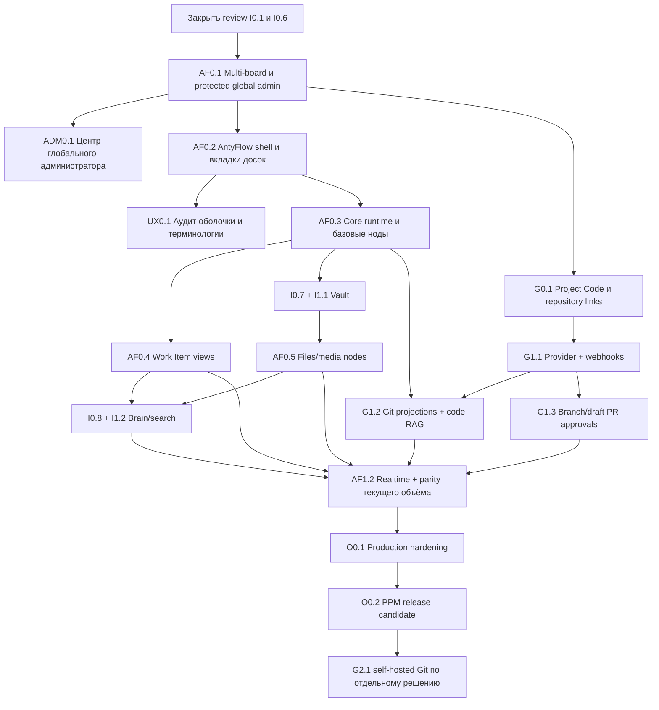

# 22 — Полный план завершения PPM

## Назначение

Это единый мастер-план PPM. Он объединяет:

1. уже реализованный фундамент Plane/PPM;
2. всё, что осталось незавершённым в предыдущем Intelligence-first плане;
3. полный перенос desktop AntyFlow в web;
4. обязательную интеграцию Git;
5. подготовку продукта к командной и production-эксплуатации.

Решение владельца от 2026-09-23: AI-провайдеры, AI-чат, проектные агенты и внешние
источники для них исключены из плана PPM 1.0 без даты возврата. Карточки I0.9,
AF1.1, I1.3 и I1.4 остаются только историческим архивом; их разработка, приёмка
и поддержка не являются задачами этой очереди. Уже написанный код не удаляется.
Project Brain в этом плане означает индексирование, поиск, граф, память проекта
и проверяемые источники без вызова AI-модели.

Новая линия AntyFlow не отменяет старые задачи I0/I1/G. Задача может исчезнуть из критического пути только после
приёмки владельцем либо явного решения об исключении с обновлением матрицы требований.

## Неподвижные условия

- пользователь работает в самостоятельном продукте PPM, без Plane branding на основном пути;
- Plane остаётся внутренним движком пользователей, проектов и Work Items;
- у проекта один общий Canvas и много общих досок;
- только protected global admin видит все проекты;
- РП, участник и наблюдатель видят только проекты, куда добавлены;
- desktop AntyFlow — функциональный и визуальный эталон Canvas;
- Vault владеет файлами и Markdown, Plane — задачами, Git provider — кодом;
- Git — обязательная часть целевого продукта, а не внешняя кнопка со ссылкой;
- Git-запись выполняет только пользователь после preview и подтверждения;
- небезопасные Electron-механизмы заменяются web/server adapters;
- никакая новая функция не считается готовой без permission, persistence, failure и regression checks.

## Фактическая точка старта

### Принято владельцем

| Задача | Что уже есть | Как используется дальше |
|---|---|---|
| I0.3 | PPM shell, русский первый вход и базовая навигация | не переписывать; пройти UX0.1 regression audit |
| I0.4 | web route `Мозг проекта` и browser-safe Canvas core | основа полного AntyFlow runtime |
| I0.5 | сохранение Canvas, версии и project permissions | мигрировать в multi-board без потери истории |

### Реализовано, но ждёт owner review

| Задача | Остаток |
|---|---|
| I0.1 | принять baseline/fork/restart gate либо вернуть с конкретными замечаниями |
| I0.6 | пройти интерактивную проверку Work Item projection двумя ролями и принять |
| I0.8 | принять project-scoped индекс, поиск и citations без AI-модели |
| I1.1 | принять Vault backlinks, versions/trash, ZIP и обмен с Документами |
| I1.2 | принять подтверждённые semantic edges, GraphRAG depth/path и Project Memory freshness |

### Не завершено из прежнего плана

| Поток | Незавершённые задачи | Сохраняемый результат |
|---|---|---|
| Бренд и оболочка | I0.2, UX0.1 | единый PPM UI, русские названия, отсутствие дублей и тупиков |
| Vault | I0.7, I1.1 | реализовано локально, I1.1 ждёт owner review: Markdown, файлы, версии, корзина, backlinks, export |
| Project Brain | I0.8, I1.2 | реализовано локально и ждёт owner review: изолированный индекс, citations, подтверждённый GraphRAG и память проекта |
| Git | G0.1, G1.1, G1.2, G1.3, G2.1 | repositories, commits, PR, Canvas, code RAG, optional self-hosting |
| Релиз | I0.10, O0.1, O0.2 | deploy, backup, observability, security и финальная приёмка |

## Сверка с предыдущими планами

Эта сверка — обязательная часть мастер-плана. Старые очереди `P0` и `PF0` не исполняются
параллельно, но каждый их незавершённый пользовательский результат имеет нового владельца.
Исключение: исторические P0.6 и PF1.1, связанные с агентами, сняты решением
владельца от 2026-09-23 и не имеют исполнителя в текущем плане.

### Первый web-first план `P0`

| Старый пункт | Где закрывается сейчас | Что обязательно сохраняется |
|---|---|---|
| P0.1 Web foundation и preview | I0.1, I0.3, I0.10, O0.1 | воспроизводимая сборка, health, env без секретов, HTTPS deploy |
| P0.2 Auth, Postgres и RLS | I0.1, AF0.1, ADM0.1, O0.1 | вход, сессия, migrations, project isolation, outsider deny, секреты только на server |
| P0.3 Команды и проекты | I0.3, AF0.1, ADM0.1, UX0.1 | проекты, состав, роли, уникальный ключ, запрет cross-project access |
| P0.4 Доска и тикеты | I0.6, AF0.4 | единые Plane Work Items, Kanban/backlog, drag, optimistic rollback, role checks |
| P0.5 Документы и файлы | I0.7, I1.1, AF0.5 | Markdown, приватные файлы, связь с задачами, версии, безопасные ключи и preview |
| P0.7 Экспорт и обзор | AF0.4, I1.1, O0.2 | счётчики проекта, CSV Work Items, Markdown-сводка, кириллица и permission checks |
| P0.8 Release gate | I0.10, O0.1, O0.2 | production-like environment, E2E, два аккаунта, error states, version/limitations, rollback и HTTPS |
| G1 Git provider | G0.1, G1.1, G1.2, G1.3, G2.1 | полный Git-контур из этапа 7, а не один `repo_url` |

### Plane-first план `PF0`

| Старый пункт | Где закрывается сейчас | Сохраняемый gate |
|---|---|---|
| PF0.1 Fork, pin и лицензия | I0.1, I0.2 | точная upstream revision, AGPL/source offer и контролируемый fork |
| PF0.2 Локальный baseline | I0.1, I0.10 | чистый запуск, auth, restart и reproducible deploy |
| PF0.3 PPM branding и первый вход | I0.2, I0.3, UX0.1 | PPM brand, русский путь и отсутствие Plane-тупиков |
| PF0.4 Вкладка «Холст» | I0.4, AF0.2 | быстрый project route и AntyFlow web shell |
| PF0.5 Project-scoped хранение | I0.5, AF0.1 | server persistence, versions, permissions и multi-board migration |
| PF0.6 Bridge Work Items/Canvas | I0.6, AF0.4 | одна задача в Plane и в Canvas без дубля |
| PF0.7 Единый deploy | I0.10, O0.1, O0.2 | один домен, login, build, rollback и release gate |
| PF1.2 Git provider | G0.1, G1.1, G1.2, G1.3 | repository/commit/PR ↔ Work Item ↔ Canvas/Brain |

### Правило нулевой потери scope

Старая карточка может быть снята с очереди только если её критерии:

1. перенесены в одну или несколько новых карточек с acceptance checks;
2. либо явно отклонены владельцем как intentional non-goal;
3. отражены в матрице требований и финальном regression gate.

Пока не выполнено одно из этих условий, пункт считается сохранённым объёмом, а не «закрытым старым
планом».

## Полная карта этапов

I1.1 зависит от Vault foundation I0.7 и projection contracts AF0.5; I0.10 остаётся единым
release gate после AF1.2. Исключённые карточки не участвуют в графе зависимостей.



## Этап 0 — закрыть и защитить уже сделанное

### Результат

Текущая ветка получает достоверный baseline: принятое не переделывается, review-задачи имеют решение, а известные
UX-регрессии превращены в тесты.

### Работы

1. Принять или вернуть с замечаниями I0.1.
2. Проверить I0.6: создание проекции, изменение Plane Work Item, reload и запрет доступа чужого проекта.
3. Закрыть I0.2 фактическим brand audit, а не состоянием дочерней задачи.
4. Выполнить UX0.1 для всех уже заявленных изменений интерфейса.
5. Зафиксировать набор smoke-сценариев, который запускается после каждого следующего этапа.

### UX-регрессии, которые обязательно проверяются

- весь основной интерфейс на русском;
- `Администратор PPM`, `Руководитель проекта`, `Участник`, `Наблюдатель` не смешиваются;
- обычный пользователь не видит управление пространством и глобальные настройки;
- нет двух одинаковых пунктов `Проекты` и двух одинаковых `Настройки`;
- `Стикеры` называются `Мои заметки`;
- у каждого проекта есть быстрый пункт `Холст`;
- `Этапы` называются `Спринты`, `Знания` — `Хранилище`, совместные страницы — `Документы`;
- неоднозначное `Представления` заменено понятным названием согласно фактическому содержимому;
- `Помощь` содержит только руководство PPM, горячие клавиши, сообщение о проблеме и версию;
- кнопка открытого кода убрана из шапки; legal/source сведения находятся в настройках/о программе;
- onboarding позволяет пропустить приглашения и войти в созданный проект;
- загрузка изображения и создание пространства либо работают, либо показывают диагностируемую причину.

## Этап 1 — права, multi-board и администрирование

### AF0.1

- один `Project Canvas` на проект;
- несколько досок с вкладками и стабильными UUID;
- миграция текущего snapshot в `Главную` без потери версий;
- board-scoped snapshots, versions, bindings, events и realtime room;
- server-side project RBAC и protected global-admin registry;
- запрет получить global admin через invitation/workspace/project role.

### ADM0.1

- отдельный центр глобального администратора;
- поиск проектов, пользователей и проблемных integrations;
- вход в любой проект с заметным admin mode;
- audit каждого сквозного просмотра и административного действия;
- re-auth для опасных операций;
- никакого появления этих экранов у РП и участников.

## Этап 2 — полноценная оболочка AntyFlow

### AF0.2

- визуальная структура desktop AntyFlow внутри PPM;
- боковая панель категорий нод и быстрый drag-and-drop;
- вкладки открытых досок, список всех досок, recent/favorite;
- create/open/rename/reorder/duplicate/archive/restore;
- camera, zoom, pan, fit, minimap, multi-select, align и keyboard navigation;
- command palette и карта горячих клавиш;
- светлая/тёмная тема PPM, responsive layout и reduced motion;
- global/project/board search без выхода из PPM.

## Этап 3 — полный browser-safe runtime AntyFlow

### Базовые ноды AF0.3

| Семейство | Возможности, которые должны сохраниться |
|---|---|
| `note`, `doc` | Markdown, редактирование, копирование, resize/collapse/fullscreen |
| `list`, `listcard` | группы, пункты, ручное создание и редактирование |
| `sheet` | таблица, размеры строк/столбцов, базовые формулы, CSV/XLSX import/export |
| `code`, `codeblock` | запрос, подсветка, копирование; выполнение только через отдельный sandbox gate |
| `diagram` | Mermaid/flowchart preview и безопасное преобразование в shapes |
| `image`, `ref` | upload/reference, preview, source metadata и permissions |
| `deck`, `slide` | ручное создание и редактирование слайдов, темы, fullscreen, PDF/PPTX export |
| graph | стрелки, ports, semantic relation, group/frame и connected context |
| runtime | versioned schema, migration, corrupted/unknown-node fallback, import/export |

### Временная шкала и память доски

- `daylane`, `tlaxis` переносятся в AF0.3; `boardmem` использует подтверждённые записи Project Brain без AI-провайдера;
- память хранится на сервере в scope проекта/доски;
- локальная память desktop не считается командной памятью;
- вычисляемый обзор и поиск связанных записей используют Project Brain и показывают источники без AI-модели.

## Этап 4 — управление работой без второй базы задач

### AF0.4 + I0.6

- `work_item_ref` с актуальным статусом, исполнителем, сроком и deep link;
- Kanban, backlog, list и saved views как `work_items_view`;
- drag между колонками обновляет Plane после permission/validation;
- optimistic update имеет rollback и понятную ошибку;
- фильтры, сортировка, группировка, swimlanes и сохранённая конфигурация;
- обзор проекта со счётчиками по статусам, CSV-экспорт Work Items и Markdown-сводка;
- экспорт учитывает текущий проект, роль, UTF-8, кириллицу и безопасное CSV-экранирование;
- массовые изменения требуют preview для опасных операций;
- Canvas checklist остаётся локальным содержимым и не маскируется под Plane Work Item.

## Этап 5 — Vault, документы и медиа

### I0.7 + I1.1

- дерево папок, Markdown editor/preview, wiki-links и backlinks;
- PDF/file upload, version history, trash/restore, rename/move и export;
- безопасные preview/download URL;
- извлечение текста и метаданных с диагностикой;
- Plane Pages остаются canonical `Документами`; явный import/export создаёт отдельную версионную копию с provenance,
  но автоматической двусторонней синхронизации нет.

### AF0.5

- Vault file/Page/PDF/image/deck projections;
- drop файла на Canvas с upload progress и повторной попыткой;
- PDF preview, выбор страниц/фрагментов и поиск с указанием источника;
- media payload не хранится внутри огромного board snapshot;
- удаление проекции не удаляет исходный файл.

## Этап 6 — Project Brain и поиск

### I0.8 + I1.2

- отдельный индекс каждого проекта;
- ingestion Work Items, Vault, Pages, PDF и разрешённых Git sources;
- incremental update, retry, reindex и purge;
- hybrid retrieval и semantic graph;
- поиск показывает проверяемые источники и версии;
- connected Canvas neighborhood участвует в контексте;
- отсутствие источников не ломает Canvas.

Фактический статус 2026-09-20: блок реализован и передан на owner review. GraphRAG использует только подтверждённые
связи текущего проекта/доски, глубину `0–2`, объяснимый путь и deterministic bonus. Project Memory хранит решения и
сводки со снимком source versions, proposal review и `possibly_stale`. Обход можно отключить через
`PPM_BRAIN_GRAPH_ENABLED=0` без потери semantic metadata и базового retrieval.
Для поиска не требуется AI-провайдер.

## Этап 7 — обязательная Git-интеграция

Git не ограничивается иконкой, страницей об исходном коде или одной ссылкой. Пользовательский раздел проекта
`Код` становится рабочей интеграцией с внешним Git provider.

### G0.1 — repository foundation

- один или несколько repositories на проект;
- default repository, HTTPS/SSH clone links и repository health;
- ручная связь branch/commit/PR с Work Item;
- permission/audit и безопасная валидация URL;
- работа VS Code и Codex через обычный Git remote.

### G1.1 — provider и синхронизация

- первый обязательный adapter: GitHub либо GitLab после ADR;
- OAuth/GitHub App, repository picker и минимальные permissions;
- branches, commits, pull/merge requests и checks в PPM;
- подписанные webhooks, replay protection, idempotency и reconciliation;
- auto-link к Work Item по ключу проекта;
- disconnect/revoke без потери исторических canonical links.

### G1.2 — Git на Canvas и в Project Brain

- repository/branch/commit/PR nodes на Canvas;
- обновление карточек по provider events;
- read-only code tree/file/diff summary с переходом к provider;
- opt-in индексирование выбранных repositories/branches;
- исключение secrets, binaries, vendor/generated paths;
- code citations: provider, repository, immutable commit SHA, path и строки;
- purge/reindex при revoke, force-push или изменении policy.

### G1.3 — безопасные write actions

- preview создания branch и draft PR;
- явное approve/reject и idempotency key;
- связь с Work Item, Vault context и Canvas neighborhood;
- статус checks/review без автоматического merge;
- branch и draft PR создаются только после явного действия пользователя; merge остаётся у Git-провайдера;
- полный audit инициатора, provider account и результата.

Текущий прогресс 2026-09-21: первый безопасный вертикальный срез реализован. Раздел «Код» формирует точный
project-scoped preview repository/base/head/title/body/Work Item, поддерживает идемпотентный operation id,
approve/reject, stale-source conflict и audit. `PPM_GIT_WRITE_ENABLED=0` остаётся значением по умолчанию, поэтому
ветки и PR на provider ещё не создаются. Низкоуровневые GitHub adapter methods для идемпотентного создания
branch и draft PR уже реализованы и проверены с минимальными scopes; к пользовательскому API они не подключены.
API и раздел «Код» диагностируют готовность GitHub App: показывают текущие/требуемые permissions, отсутствующие
scopes, состояние внешнего write-флага, нерешённый owner gate и отсутствие apply endpoint. Диагностика ничего не
записывает в GitHub и не подменяет отдельное подтверждение действия. РП или global admin может вручную перечитать
актуальные permissions установки: read-only GitHub API обновляет только локальный снимок и audit. Webhook принятия
новых permissions синхронизирует этот снимок автоматически для всех активных connections; интерфейс показывает
владельцу пошаговый безопасный порядок выдачи scopes.
До полного G1.3 остаются решение владельца по двухэтапному flow, отдельные apply-команды, точный base/head SHA,
обработка provider conflicts/rate limits/revoked token и живой E2E без дублей. Merge остаётся вне PPM.

### G2.1 — optional self-hosted Git

- отдельный ADR и пилот Forgejo/GitLab CE либо другого актуального кандидата;
- SSO, repositories, PR, webhooks, LFS, backup/restore и upgrade rehearsal;
- PPM продолжает использовать общий provider contract;
- этот этап не блокирует внешний Git provider и основной PPM 1.0.

## Этап 8 — realtime и совместимость AntyFlow в текущем объёме

### AF1.2

Статус: `in_progress`. Первый foundation уже даёт board-scoped presence через ASGI/WebSocket и Redis,
проверяет Plane session и project membership, допускает read-only guest, фиксирует global-admin connect,
перепроверяет revoke по heartbeat и показывает состояние подключения/участников в web. Живой reconnect прошёл
после чистой пересборки API. Последующие изменения добавили уведомление об изменении версии доски и обновление
другого клиента. Проверка 2026-09-23 подтвердила синхронизацию, reload и восстановление после перезапуска API
в двух вкладках одного аккаунта. Контракт API/WebSocket двух отдельных пользователей подтвердил доставку
version event, чтение нового snapshot и отказ устаревшей записи без перезаписи данных.
В двух вкладках одного аккаунта 2026-09-23 проверено явное слияние непересекающихся правок собственных нод:
сервер повторно проверяет base version, обе правки сохраняются, а повторный no-op save не создаёт версию.
После reload конфликтный черновик также сливается только после чтения его неизменяемой исходной версии,
предпросмотра и явного подтверждения; живой сценарий сохранил обе правки как версию `13` без повторной версии.
Пересекающиеся/структурные изменения остаются в режиме ручного восстановления. Это не закрывает
offline cache и полный parity gate.
Desktop-import теперь переносит координаты и поворот вложенных нод в систему страницы, а рамки допустимого
размера — как редактируемые PPM-элементы. Вложенность поддерживаемых групп и рамок
восстанавливается; неподдерживаемые родители явно помечаются уплощёнными, а
нативные tldraw-группы с менее чем двумя прямыми детьми остаются заглушками.
Неоднозначные parent-связи отклоняются до изменения общей доски. Реальный пользовательский
desktop-файл ещё не проверен. Стрелки с двумя корректными bindings сохраняют точки крепления
к импортированным нодам и рамкам; поддерживаемые стили и подписи связанных стрелок также переносятся.
Валидные свободные стрелки без bindings теперь также переносятся с локальной геометрией, стилем и подписью;
частичные или повреждённые остаются заглушками. Отчёт миграции v3 отдельно считает свободные стрелки.
Синтетический `.flow.json` со свободной стрелкой прошёл в браузере import→save→reload на отдельной
доске: 3 элемента и 0 заглушек, серверная версия `1`, все объекты восстановились после перезагрузки.
Дополнительно на отдельной доске «I03 Проверка» импортирован синтетический fixture с двумя нодами и
одной связанной стрелкой: предпросмотр показал 3 элемента и 0 заглушек, сервер сохранил версию `1`,
а обе ноды повторно открылись после reload. Read-only проверка версии подтвердила 3 shape и 2 bindings
`start/end` к разным нодам; геометрия связи после reload визуально отдельно не сверялась.
Повторная UI-проверка по разрешению владельца на новой доске `AF1.2 — Проверка импорта AntyFlow`
подтвердила загрузку этого fixture через обычный выбор файла, сохранение версии `1` и
2 ноды + 1 стрелку после reload. Доска «Главная» не менялась.
Реальный пользовательский desktop-файл и полная визуальная parity ещё открыты.
В локальном браузерном E2E руководитель и участник одновременно видят presence `2`, получают
подтверждённые правки друг друга без reload, а устаревший PUT участника после новой версии
руководителя приводит к видимому конфликту без перезаписи серверного snapshot. Остаются
браузерные проверки offline/reconnect и прочие gates AF1.2. Read-only гость не может
редактировать доску; отзыв доступа закрывает открытую доску и возвращает API `403`.
Понижение участника с edit до read закрывает прежнюю сессию, а после reload открывает
только read-only доску; восстановление роли возвращает edit. Эти проверки проведены
на отдельном синтетическом проекте, исходные роли восстановлены. Локальный `429`
на обязательном `/api/instances/` устранён отдельным ограниченным bootstrap-лимитом:
все 7 браузерных сценариев прошли подряд. Дополнительно проверены сохранение
офлайн-заметки после reconnect без нового действия, безопасный конфликт с новой
правкой коллеги и отказ участнику другого проекта в API, WebSocket и web-редакторе.
Локальный браузерный smoke также восстановил 300 синтетических заметок после reload при пяти
открытых вкладках досок; масштабирование и перемещение холста работали. Замер на Mac —
около 1,9 с на повторную загрузку и 0,2–0,4 с на переключение; бюджет для целевой VM
ещё не принят. Долговечная offline-очередь и полный parity gate остаются открытыми.
Локальная матрица Chrome/Firefox/WebKit прошла 300-shape smoke и все семь сценариев
совместной работы на движок, включая отзыв прав и понижение роли. Тест revoke
автоматически восстанавливает синтетическое членство; роли проверены после каждого
прогона. Ошибка CSRF-входа в Firefox исправлена:
токен теперь получается непосредственно перед отправкой пароля, отказ показывает
ошибку без POST. Изолированная локальная фикстура теперь создаёт на одноразовой БД
три синтетические роли и два закрытых проекта без ручных ID; полный browser gate
проходит на новой БД в Chrome, Firefox и Playwright WebKit (`9/9` на каждом),
включая 300 shapes и пять вкладок. Следующий клавиатурный срез добавил навигацию
между вкладками ArrowLeft/ArrowRight/Home/End, удержание фокуса в Canvas-диалогах и
возврат фокуса после закрытия; новый сценарий прошёл вместе с полным набором
во всех трёх движках (`10/10` на каждом). Скрипт очищает свой стек после проверки.
Ручной CI workflow подготовлен для чистого checkout, но не опубликован и не запускался
в GitHub Actions. Локальный PostgreSQL + файловый Vault backup/restore проверен на одноразовом стеке:
после `pg_dump`/`pg_restore` и переноса архива в отдельный том совпали хэши снимков,
история 7 досок/6 версий Canvas, четыре версии двух материалов Vault, роли и API-изоляция.
Восстановление только БД ожидаемо не проходит. На восстановленной БД три синтетические роли
успешно вошли через CSRF-protected парольный маршрут и новые сессии, открыли свои проект,
Canvas и Vault; чужой проект остался закрыт. Следующий Chrome gate `10/10` добавил один
синтетический Plane Work Item: ID, автор, номер, состояние и приоритет совпали до/после restore;
новые сессии РП и участника читают его, гость получает `403`. Целевые контракты — `23 passed`.
Это не полный системный backup: Plane attachments,
внешнее object storage, конфигурация, производные индексы, реальные пользовательские Work Items,
целевая VM и браузерный вход в восстановленную
среду ещё открыты,
как и устройства, полный a11y-аудит и desktop parity.
Следующий срез подготовил проверку одного синтетического Plane attachment через два независимых
MinIO: объект и его checksum должны сохраниться после переноса, а восстановление одной БД и Vault
без него — провалиться. В ходе контрактной проверки закрыт доступ гостя к вложениям чужой задачи
на legacy/v2/API v1 маршрутах и подстановка вложения от другой задачи в API v1;
Canvas/Vault contract suite `99 passed`. Сам object-storage drill пока **не подтверждён**:
Docker daemon возвращает `EOF` при загрузке образа из Docker Hub и Quay. После восстановления
доступа к registry нужен полный повтор `bash scripts/ppm-canvas-browser-gate.sh chrome`.
В живом локальном PPM на `320 px` устранено переполнение шапки Холста: вкладки
заменяются переключателем досок, команды имеют доступные имена. Изолированный
Playwright-тест выявил и помог исправить повторное открытие общей боковой панели,
которое обнуляло ширину редактора, и перекрытие переключателя досок развёрнутой
панелью AntyFlow. На узком экране она свёрнута по умолчанию и может раскрываться
вручную. Отдельный `--browser-only` режим обходит недоступный MinIO image, но
не выполняет backup/restore. Добавленный Axe-audit обнаружил критическое нарушение
структуры `tablist` и помог исправить связь вкладок со списком; создание доски
вынесено за пределы `tablist`. WCAG A/AA проверен внутри Холста на `1440/320 px`
в состояниях обычной доски, переключателя и палитры команд. Chrome, Firefox и
WebKit прошли по `12/12` browser E2E; web unit suite `85 passed`, TypeScript,
Oxlint/Oxfmt, `bash -n` и production build прошли. Это test-only зависимость
`@axe-core/playwright` (`MPL-2.0`), не runtime. Полный MinIO restore,
скринридер/ручной a11y, другие устройства и desktop parity gates остаются открытыми.
Следующий срез сохраняет несохранённые правки Холста в `localStorage` отдельно для
пользователя, проекта, доски и экземпляра редактора; разные вкладки не затирают
друг друга. После повторного открытия пользователь выбирает черновик и явно
подтверждает восстановление, а более новая версия сервера блокирует перезапись.
Браузерный gate с переносом storage state в новый контекст, полным перезапуском
браузерного процесса с постоянным профилем, конфликтом и двумя offline-вкладками
прошёл на одноразовой БД: Chrome/Firefox/WebKit `16/16` каждый;
web unit suite `88 passed`, TypeScript, Oxlint/Oxfmt и production build прошли.
Это долговременная локальная копия с ограничениями квоты/очистки браузера, а не
автоматическая offline-очередь и не серверный backup. Повторная попытка получить
закреплённый MinIO image завершилась `EOF`, прямой архив бинарника — `410`;
object-storage restore остаётся неподтверждённым.
Следующий срез сохраняет полный неподтверждённый запрос Холста вместе с
`client_operation_id`: после перезапуска он повторяется с тем же ID. Если сервер
сохранил запрос, но ответ потерялся, idempotent replay позволяет продолжить
поздние локальные правки; чужая более новая версия даёт `409` без перезаписи.
Browser-only gate на одноразовой БД прошёл Chrome/Firefox/WebKit по `17/17`,
web unit suite `89 passed`, brand unit suite `19 passed` и brand audit прошли.
Полная фоновая очередь, MinIO/attachments restore, целевая VM, ручной a11y и
owner-approved desktop parity всё ещё обязательны до закрытия AF1.2.

Локальная блокировка MinIO restore снята: тестовый ARM64-образ собран из
официальных release binaries MinIO/mc после проверки SHA-256, без изменения
production-образа. Полный gate с Chrome `17/17` затем восстановил PostgreSQL,
Vault и Plane S3 attachment в изолированные хранилища, проверил контрольные
суммы, вход трёх ролей и отказ чужому проекту. Команда и ограничения приведены
в карточке AF1.2. Целевая VM, опубликованный CI gate и эксплуатационная
проверка резервирования остаются открытыми.
Следующий срез AF1.2 автоматически повторяет временно неудавшееся HTTP-сохранение
в открытой вкладке с тем же `client_operation_id` и payload; `409` и постоянные
`4xx` не повторяются. На текущем коде полный локальный gate дал Chrome `18/18`
и успешное восстановление PostgreSQL, Vault и Plane attachment из отдельных
хранилищ; Firefox и WebKit прошли browser-only gate по `18/18`, web unit suite —
`91 passed`. Это ещё не фоновая синхронизация закрытого браузера и не приёмка
на целевой VM. Опубликованный CI, ручной a11y, реальный desktop-файл и
согласованная владельцем parity matrix остаются обязательными.

Проверка защищённой роли главного администратора 2026-09-23 добавила WebSocket/audit
контракт для двух чужих проектов, отзыв роли в уже открытых соединениях и четвёртую
роль в одноразовом browser/restore gate. Локальная матрица достигла Chrome/Firefox/WebKit
`19/19`; полный Chrome gate восстановил PostgreSQL, Vault и Plane attachment и проверил
вход четырёх ролей. Путь «центр администратора → чужой проект → холст» дополнительно
прошёл во всех трёх движках; явный баннер администратора теперь не теряется при
переходе по боковому меню. По разрешению владельца синтетический `.flow.json` ещё раз
прошёл UI import→save→reload в отдельной доске «I03 Проверка». Это не заменяет
реальный desktop-файл, полную визуальную parity, публикацию CI, целевую VM и ручную
проверку доступности. AF1.2 остаётся `in_progress`.

Для AF1.2 добавлено восстановление открытых вкладок и активной доски после reload
в текущем браузере с раздельным ключом пользователя/проекта и серверной проверкой
активных досок. Архивные и недоступные доски не восстанавливаются. Кнопки
редактирования ожидают загрузки доски и подтверждения права на запись, чтобы
ранний клик не терялся. Межустройственная синхронизация вкладок и оставшиеся
parity/release проверки по-прежнему открыты.
Локальный полный Chrome gate на этом срезе — `19/19` плюс восстановление
PostgreSQL/Vault/Plane attachment и контроль четырёх ролей; целевые сценарии
Firefox и WebKit — browser-only `3/3` каждый. Web unit suite — `94 passed`,
TypeScript/Oxlint и production build прошли. Это не закрывает целевую VM,
опубликованный CI, ручной a11y и owner-approved desktop parity.

Срез 2026-09-24: вложенная нативная группа, рамка, две заметки и свободная стрелка
прошли import→save→reload с сохранением parent ID и локальных координат в
изолированном E2E Chrome, Firefox и WebKit (`1/1` каждый). Отдельная синтетическая доска `AF1.2 Проверка импорта — синтетика`
в «I03 Проверка» сохранена и повторно открыта через обычный UI; основная доска
не менялась. Web unit suite — `97 passed`, TypeScript/Oxlint и production build
прошли. Реальный desktop-файл, assets/формулы и owner-approved visual parity
ещё ожидают проверки; статус AF1.2 остаётся `in_progress`.

- board-scoped presence, cursors и совместное редактирование;
- reconnect, offline cache и разрешение конфликтов без молчаливой потери данных;
- large-board performance budgets;
- keyboard/accessibility и responsive checks;
- импорт desktop `.flow.json` с отчётом и unknown-node preservation;
- строки текущего объёма матрицы 21 получают `done` только после UX, permission, persistence и tests;
- intentional differences утверждает владелец.

## Этап 9 — эксплуатация и релиз

### I0.10

Единый demo/release gate объединяет auth, projects, Work Items, Canvas, Vault, Brain, Git и role isolation в одном
воспроизводимом окружении.

### O0.1

- production-like deployment manifests;
- migrations, object storage и realtime health;
- structured logs, metrics, traces и alerting;
- encrypted secrets и rotation runbook;
- backup/restore drill для DB, Vault и provider metadata;
- rate limits, security headers, dependency/license scan;
- capacity/performance test и disaster recovery rehearsal.

### O0.2

- migration существующих проектов и desktop boards;
- regression E1–E11, Git E2E и cross-project negative suite;
- owner acceptance по ролям;
- legal/source offer и точные upstream revisions;
- release notes, known limitations и rollback rehearsal;
- только после этого продукт получает статус PPM release candidate.

## Очередность исполнения

Одна reviewable карточка за раз:

```text
I0.1 review → I0.6 review → AF0.1 → ADM0.1 → AF0.2 → UX0.1 → AF0.3
→ AF0.4 → I0.7 → AF0.5 → I0.8 → I1.1 → I1.2
→ G0.1 → G1.1 → G1.2 → G1.3 → AF1.2
→ I0.10 → O0.1 → O0.2
→ G2.1 по отдельному решению
```

Допускается техническая подготовка независимого потока, но одновременно изменять одну и ту же модель Canvas,
permissions или provider contract в разных ветках нельзя.

Текущий gate: owner review I1.2/G1.1/G1.2, завершение пользовательского Git write flow G1.3 и совместной
работы на доске AF1.2. В G1.3 уже готовы preview, approve/reject, idempotency, stale-source conflict и audit;
следующий шаг — Git write-permission ADR, отдельная apply-команда и живой E2E branch/draft PR.
Для AF1.2 следующий шаг — a11y/browser matrix, backup/restore, performance-бюджеты на
целевой конфигурации и утверждение оставшихся расхождений с desktop AntyFlow.

## Оценка масштаба

Это ориентир для планирования, не обещание календарной даты.

| Блок | Ориентир reviewable сессий |
|---|---:|
| закрытие текущих review и UX-аудит | 2–4 |
| multi-board, admin, shell | 5–8 |
| core AntyFlow nodes и work views | 8–13 |
| Vault и media | 5–8 |
| Project Brain: индекс, поиск и граф без AI-провайдера | 1–2 на review и регрессию |
| Git G0/G1 | 7–11 |
| realtime/parity | 4–7 |
| production/release | 4–7 |
| **обязательный PPM 1.0** | **36–60 суммарно; это не оценка оставшихся сессий** |
| self-hosted Git после 1.0 | по отдельному решению |

Оценка уточняется после AF0.1 и аудита текущего кода. Сессия заканчивается проверяемым diff, тестами и карточкой на
owner review; большое число строк без законченного gate не считается сессией результата.

## Definition of Done всего продукта

PPM не считается завершённым, пока одновременно не выполнено следующее:

1. protected global admin видит все проекты, остальные роли — только назначенные;
2. каждый проект имеет общий multi-board Canvas с проверенной parity текущего объёма;
3. задачи, файлы и Git-объекты не дублируют свои источники истины;
4. Vault, Brain и citations работают после restart и переиндексации;
5. Git provider проходит connect → push → webhook → Work Item → Canvas → code citation;
6. Git write actions проходят preview/approval/audit;
7. realtime не теряет изменения при reconnect/conflict;
8. backup действительно восстановлен в отдельном окружении;
9. cross-project negative suite не обнаруживает утечек;
10. владелец принял обязательные карточки, а документация соответствует фактическому продукту.

## Что не блокирует PPM 1.0

- второй и последующие внешние Git providers;
- self-hosted Git G2.1;
- автоматический merge.
